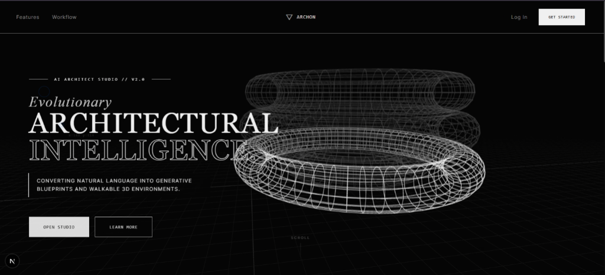
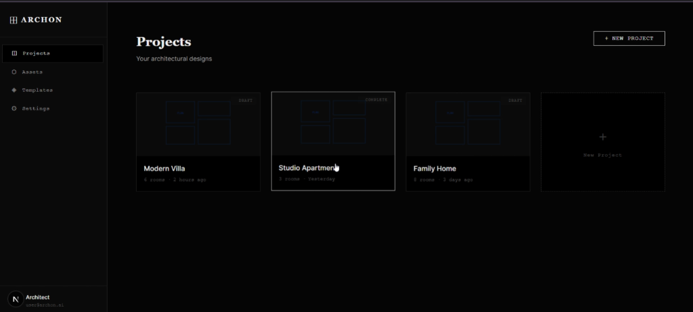
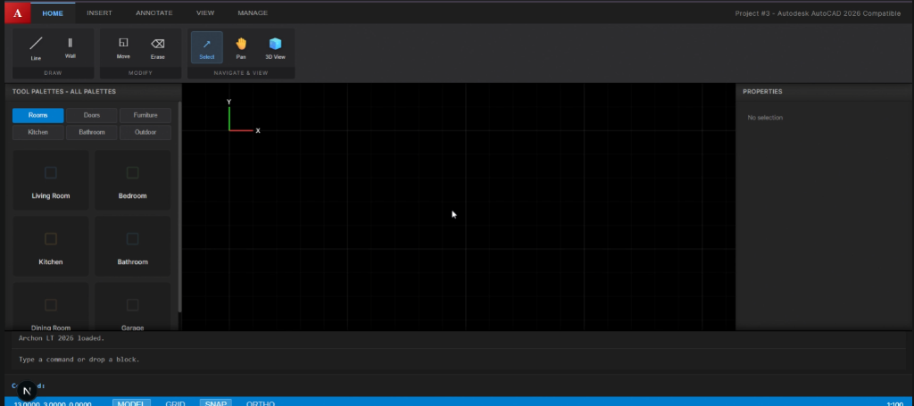

# ARCHON -- AI Architect Studio

ARCHON is an AI-powered architectural design studio built as a modern web application. It enables users to describe building requirements in plain English and generates constraint-checked floor plans, interactive 2D blueprints, and walkable 3D environments -- all within the browser.

---

## Table of Contents

- [Overview](#overview)
- [Features](#features)
- [Tech Stack](#tech-stack)
- [Project Structure](#project-structure)
- [Getting Started](#getting-started)
- [Pages and Screens](#pages-and-screens)
  - [Loading Screen](#loading-screen)
  - [Landing Page](#landing-page)
  - [Login Page](#login-page)
  - [Dashboard](#dashboard)
  - [Project Editor (2D CAD)](#project-editor-2d-cad)
  - [Project Editor (3D View)](#project-editor-3d-view)
- [Screenshots](#screenshots)
- [Architecture](#architecture)
- [Design System](#design-system)
- [License](#license)

---

## Overview

ARCHON combines natural language processing with real-time 2D/3D rendering to provide an end-to-end architectural design workflow. The application follows a brutalist, monochrome design language inspired by professional CAD software, featuring ASCII art animations, wireframe 3D monument renders, and a full AutoCAD-style project editor with drag-and-drop asset placement, snap-to-grid precision, and a command-line interface.

The application is a frontend prototype demonstrating the user interface, interaction design, and rendering pipeline. It showcases advanced browser-based rendering using Three.js for 3D scenes, HTML Canvas for 2D CAD drawing, and CSS animations for micro-interactions.

---

## Features

**Prompt-to-Plan Generation**
Describe building requirements in natural language. The AI generates a structured, constraint-checked floor plan based on the input.

**Interactive 2D Editor**
A full CAD-style canvas with drag-and-drop asset placement, snap-to-grid alignment, zoom and pan controls, and keyboard shortcuts. Modeled after the AutoCAD interface with a ribbon toolbar, tool palettes, properties panel, and command line.

**3D Architectural Preview**
One-click toggle from 2D to 3D view. The editor extrudes placed floor plan elements into a walkable Three.js scene with orbit controls, lighting, and real-time rendering.

**Asset Library**
Drag-and-drop from a curated library of rooms, doors, furniture, kitchen fixtures, bathroom elements, and outdoor assets. Each asset snaps to the grid and can be resized, rotated, and relabeled.

**AI-Powered Edits**
Iterative natural-language refinements through the command line. Type commands like "make the kitchen larger" to modify the layout.

**Geometry Engine**
Rules-based validation for walls, adjacency constraints, openings, and collision-free layouts.

**3D Monument Showcase**
The landing page features a real-time Three.js scene rendering wireframe monuments (Colosseum, Faisal Mosque, Tower of Pisa, Statue of Liberty) with holographic ghost effects, mouse parallax, and automatic rotation cycling.

**ASCII Art Rendering**
A secondary ASCII rendering engine converts 3D monument geometry into density-mapped ASCII characters with per-monument color palettes, smooth build/fade transitions, and camera orbit animation.

**Cinematic Loading Screen**
A branded loading sequence with a circular progress ring, status messages, background video, scanline overlay, and fade-in transitions.

**Custom Crosshair Cursor**
A dual-element cursor system with an instant-follow dot, a smooth-lagged ring, and live coordinate readout -- reinforcing the drafting tool aesthetic.

---

## Tech Stack

| Layer        | Technology                                      |
|--------------|--------------------------------------------------|
| Framework    | Next.js 16 (App Router, Turbopack)               |
| Language     | TypeScript                                        |
| UI Library   | React 19                                          |
| 3D Rendering | Three.js                                          |
| 2D Rendering | HTML5 Canvas API                                  |
| State        | Zustand, React useState                           |
| Styling      | CSS Modules, CSS Custom Properties (Design Tokens)|
| Typography   | Inter, Playfair Display, Roboto Mono, Press Start 2P, Cormorant Garamond |
| Build Tool   | Turbopack (via Next.js)                           |

---

## Project Structure

```
aimodel/
  frontend/
    public/
      archon-logo.mp4          # Background video for loading screen
      fonts/                   # Custom font files (Savon trial)
    src/
      app/
        globals.css            # Design system tokens, reset, utilities
        layout.tsx             # Root layout with metadata
        page.tsx               # Landing page (hero, features, workflow, CTA)
        page.module.css        # Landing page styles
        login/
          page.tsx             # Authentication page (login/register)
          page.module.css      # Login page styles
        dashboard/
          page.tsx             # Project dashboard with card grid
          page.module.css      # Dashboard styles
        project/
          [id]/
            page.tsx           # Full CAD editor (2D canvas + 3D toggle)
            page.module.css    # Editor styles
            Architectural3DView.tsx  # Three.js 3D floor plan renderer
      components/
        ArchitectureScene3D.tsx     # Hero 3D wireframe monument scene
        ASCIIBuilding3D.tsx         # ASCII art monument renderer
        ASCIIHero.tsx               # Static ASCII building art
        ASCIIBuilding3D.module.css
        ASCIIHero.module.css
        CrosshairCursor.tsx         # Custom dual-cursor system
        LoadingScreen.tsx           # Cinematic loading sequence
        LoadingScreen.module.css
        Navbar.tsx                  # Global navigation bar
        Navbar.module.css
    package.json
    tsconfig.json
    next.config.ts
```

---

## Getting Started

### Prerequisites

- Node.js 18 or later
- npm 9 or later

### Installation

1. Clone the repository:

```bash
git clone https://github.com/arham899/archon-ai-architect.git
cd archon-ai-architect/frontend
```

2. Install dependencies:

```bash
npm install
```

3. Start the development server:

```bash
npm run dev
```

4. Open the application in your browser:

```
http://localhost:3000
```

### Build for Production

```bash
npm run build
npm run start
```

---

## Pages and Screens

### Loading Screen

The application opens with a cinematic loading sequence. A circular progress ring animates from 0 to 100 percent while status messages cycle through initialization stages: loading modules, initializing the geometry engine, connecting the AI service, preparing the workspace, and rendering the environment. The background plays a looping video with a dark overlay and a horizontal scanline effect. The ARCHON logo is centered with horizontal accent lines on either side.

### Landing Page

The landing page serves as the primary marketing surface. It consists of five sections:

- **Hero Section**: A full-viewport Three.js scene renders rotating wireframe monuments (Colosseum, Faisal Mosque, Tower of Pisa, Statue of Liberty) with holographic ghost effects rising upward. Overlaid text uses a typewriter animation to reveal the headline "Evolutionary Architectural Intelligence." Two call-to-action buttons link to the studio and the features section. A scroll indicator appears at the bottom.

- **Features Section**: A six-card grid presenting the core capabilities (Prompt-to-Plan, 2D Editor, 3D Preview, Asset Library, AI Edits, Geometry Engine). Each card has a monospaced icon, title, and description. The background plays the branding video behind a dark overlay.

- **Workflow Section**: A four-step horizontal layout walking users through the process: Describe, Generate, Refine, Visualize.

- **Call-to-Action Section**: A centered heading with a link to open the studio.

- **Footer**: Copyright and links to GitHub and documentation.

### Login Page

A split-panel layout. The left panel displays the ARCHON brand identity with an ASCII building sketch. The right panel contains a form with email and password fields, a submit button, and a toggle to switch between login and registration modes. Submitting the form redirects to the dashboard.

### Dashboard

A sidebar-and-main layout. The left sidebar contains navigation links (Projects, Assets, Templates, Settings) and a user badge. The main area displays a grid of project cards. Each card shows a miniature SVG blueprint preview, the project status (draft or complete), the project name, room count, and last-modified timestamp. A "New Project" button opens an inline creation form. Clicking a project card navigates to the project editor.

### Project Editor (2D CAD)

The editor replicates a professional CAD interface:

- **Ribbon Toolbar**: Tabbed menu bar (Home, Insert, Annotate, View, Manage) with grouped tool panels for Draw (Line, Wall), Modify (Move, Erase), and Navigate/View (Select, Pan, 3D View toggle).

- **Left Palette (Tool Palettes)**: Categorized asset library (Rooms, Doors, Furniture, Kitchen, Bathroom, Outdoor). Each asset is draggable onto the canvas.

- **Center Canvas**: An HTML5 Canvas rendering an infinite grid with minor and major grid lines, a UCS origin icon (red X-axis, green Y-axis), and all placed assets as labeled rectangles. Supports zoom (scroll wheel), pan (middle-click or pan tool), snap-to-grid placement, selection with grip handles, and drag-to-move.

- **Right Palette (Properties)**: Displays editable properties for the selected asset including color, layer, block name, position, scale, and rotation. Includes Rotate 90 and Delete actions.

- **Bottom Command Line**: A scrollable history log and text input field for AutoCAD-style commands (LINE, ERASE, PAN, 3D, 2D, GENERATE). A status bar shows live cursor coordinates, toggle buttons for MODEL, GRID, SNAP, and ORTHO modes, and the current scale ratio.

### Project Editor (3D View)

Toggling to 3D mode replaces the canvas with a Three.js scene. Placed floor plan assets are extruded into 3D boxes with height based on asset category. The scene includes ambient and directional lighting, orbit controls, and a ground grid. The camera targets the center of the placed layout.

---

## Screenshots

### Landing Page

The hero section features a full-viewport Three.js wireframe monument scene with typewriter text animation, mouse parallax, and call-to-action buttons.



---

### Project Dashboard

The dashboard displays a grid of project cards with blueprint previews, status indicators, and metadata. A sidebar provides navigation to Projects, Assets, Templates, and Settings.



---

### Project Editor (2D CAD View)

The full CAD editor with a ribbon toolbar, categorized tool palettes on the left, an infinite-grid canvas with UCS origin marker in the center, a properties panel on the right, and a command line with status bar at the bottom.



---

## Architecture

### Rendering Pipeline

The application uses three distinct rendering approaches depending on context:

1. **Three.js WebGL** -- Used for the landing page monument showcase, the hero background, and the project 3D view. Scenes are constructed programmatically using Three.js geometry primitives (cylinders, tori, cones, spheres, boxes) with both mesh fills and wireframe edge overlays.

2. **HTML5 Canvas 2D** -- Used for the project editor's CAD viewport. The canvas redraws on every animation frame, rendering the grid, placed assets, selection grips, drop previews, and the UCS origin marker. All coordinates are transformed through a zoom/pan matrix.

3. **ASCII Rasterizer** -- The ASCIIBuilding3D component renders a Three.js scene to a small offscreen canvas, reads back pixel brightness values, and maps them to density-ordered ASCII characters with per-monument color palettes. The result is written as colored HTML spans to a pre element overlay.

### State Management

- **Component-local state** (React useState) handles UI toggles, form inputs, and per-page concerns.
- **Zustand** is available for cross-component shared state when needed.
- **Refs** manage animation frame IDs, drag state, and pan coordinates to avoid unnecessary re-renders during high-frequency mouse events.

### Routing

Next.js App Router with dynamic segments:
- `/` -- Landing page
- `/login` -- Authentication
- `/dashboard` -- Project list
- `/project/[id]` -- Project editor

---

## Design System

The visual language follows a brutalist, monochrome aesthetic:

- **Colors**: Near-black backgrounds (#050505), white text, zero-saturation palette. No rounded corners (all border-radius set to 0).
- **Typography**: Five font families layered for hierarchy -- Playfair Display for editorial headings, Inter for body text, Roboto Mono for technical labels and inputs, Press Start 2P for pixel-art accents, and Cormorant Garamond for cursive flourishes.
- **Spacing**: An 8-point grid system with generous architectural whitespace.
- **Shadows**: Eliminated at small scales; heavy offset shadows only on elevated surfaces.
- **Texture**: A full-viewport SVG noise overlay at 3.5 percent opacity simulates charcoal paper grain.
- **Animations**: Typewriter text reveal, fade-in-up entrances, pulse/flicker for ambient motion, scanline sweep, and cursor blink.

---

## License

This project is provided as-is for educational and portfolio purposes.

---

Built by [Muhammad Arham](https://github.com/arham899)
